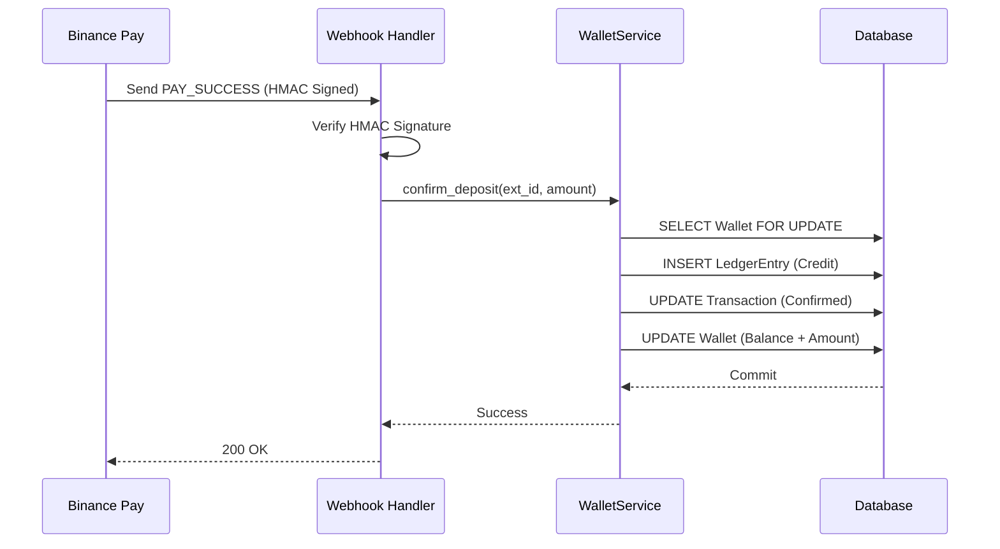
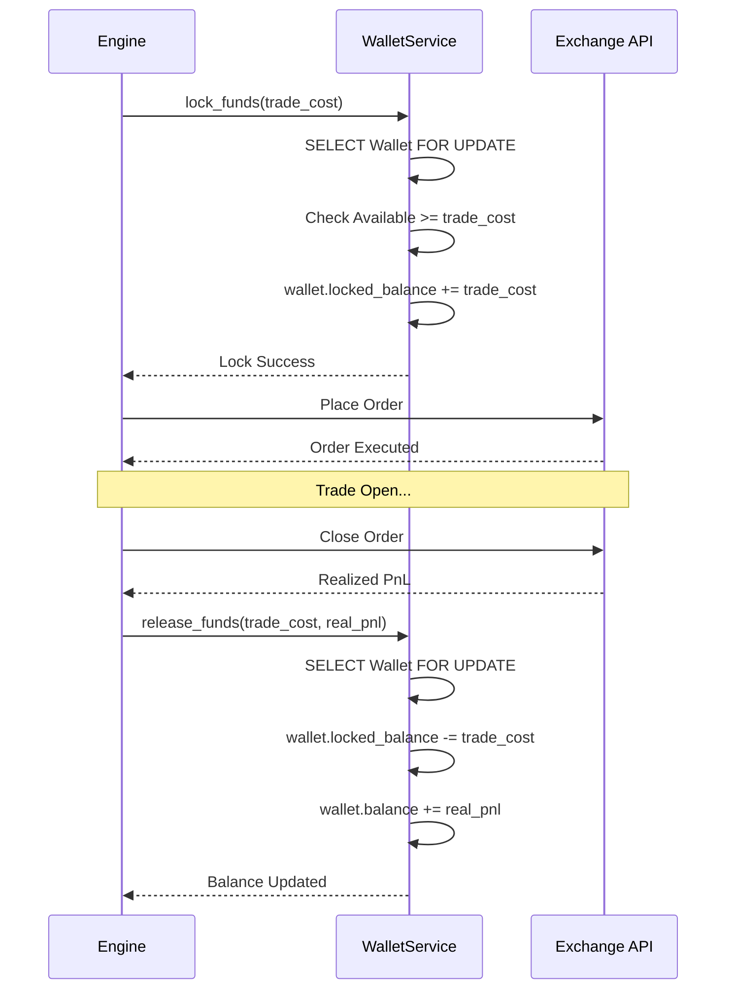
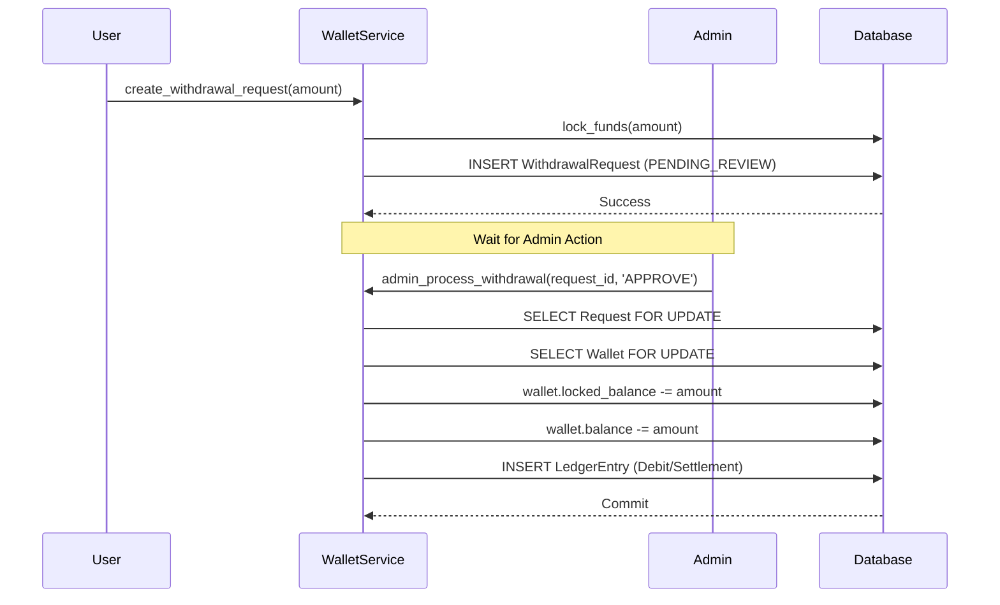

# Money Flow Diagrams

## 1. Deposit Flow (External → Ledger)

```mermaid
sequenceDiagram
    participant B as Binance Pay
    participant W as Webhook Handler
    participant S as WalletService
    participant D as Database

    B->>W: Send PAY_SUCCESS (HMAC Signed)
    W->>W: Verify HMAC Signature
    W->>S: confirm_deposit(ext_id, amount)
    S->>D: SELECT Wallet FOR UPDATE
    S->>D: INSERT LedgerEntry (Credit)
    S->>D: UPDATE Transaction (Confirmed)
    S->>D: UPDATE Wallet (Balance + Amount)
    D-->>S: Commit
    S-->>W: Success
    W-->>B: 200 OK
```

## 2. Trading Flow (Funding & PnL)

```mermaid
sequenceDiagram
    participant E as Engine
    participant S as WalletService
    participant X as Exchange API

    E->>S: lock_funds(trade_cost)
    S->>S: SELECT Wallet FOR UPDATE
    S->>S: Check Available >= trade_cost
    S->>S: wallet.locked_balance += trade_cost
    S-->>E: Lock Success
    E->>X: Place Order
    X-->>E: Order Executed
    Note over E,X: Trade Open...
    E->>X: Close Order
    X-->>E: Realized PnL
    E->>S: release_funds(trade_cost, real_pnl)
    S->>S: SELECT Wallet FOR UPDATE
    S->>S: wallet.locked_balance -= trade_cost
    S->>S: wallet.balance += real_pnl
    S-->>E: Balance Updated
```

## 3. Withdrawal Flow (User Request → Admin Approval)

```mermaid
sequenceDiagram
    participant U as User
    participant S as WalletService
    participant A as Admin
    participant D as Database

    U->>S: create_withdrawal_request(amount)
    S->>D: lock_funds(amount)
    S->>D: INSERT WithdrawalRequest (PENDING_REVIEW)
    D-->>S: Success
    Note over A,S: Wait for Admin Action
    A->>S: admin_process_withdrawal(request_id, 'APPROVE')
    S->>D: SELECT Request FOR UPDATE
    S->>D: SELECT Wallet FOR UPDATE
    S->>D: wallet.locked_balance -= amount
    S->>D: wallet.balance -= amount
    S->>D: INSERT LedgerEntry (Debit/Settlement)
    D-->>S: Commit
```
